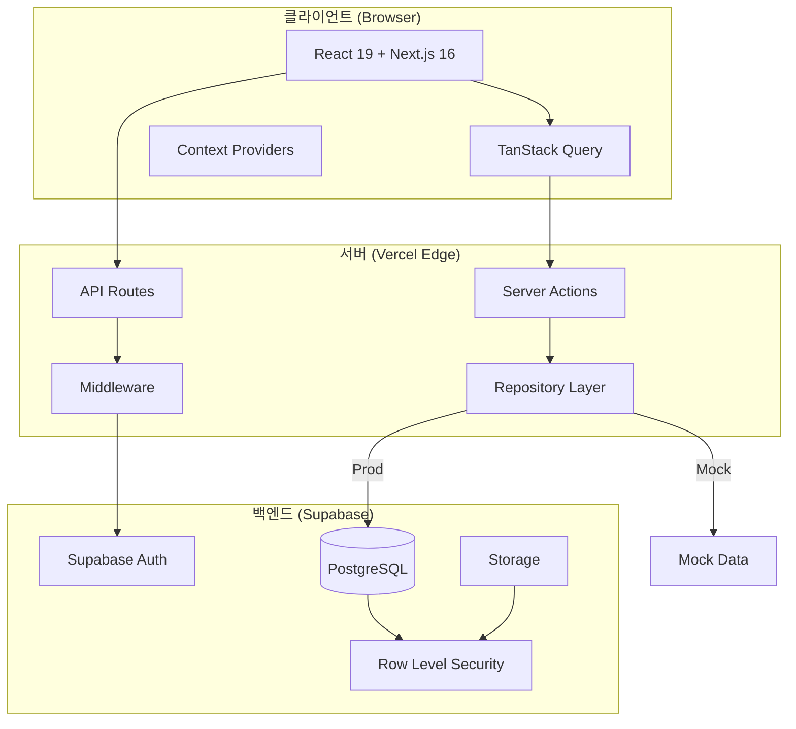
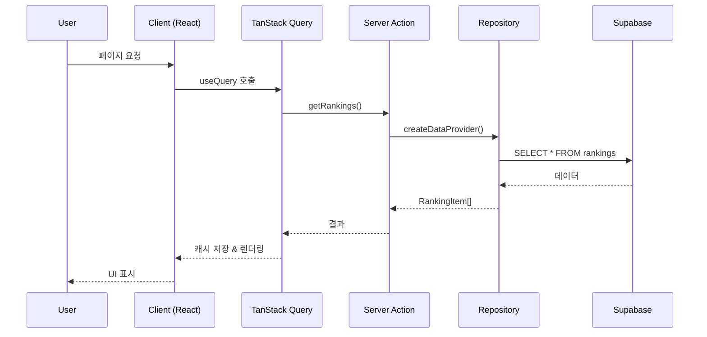
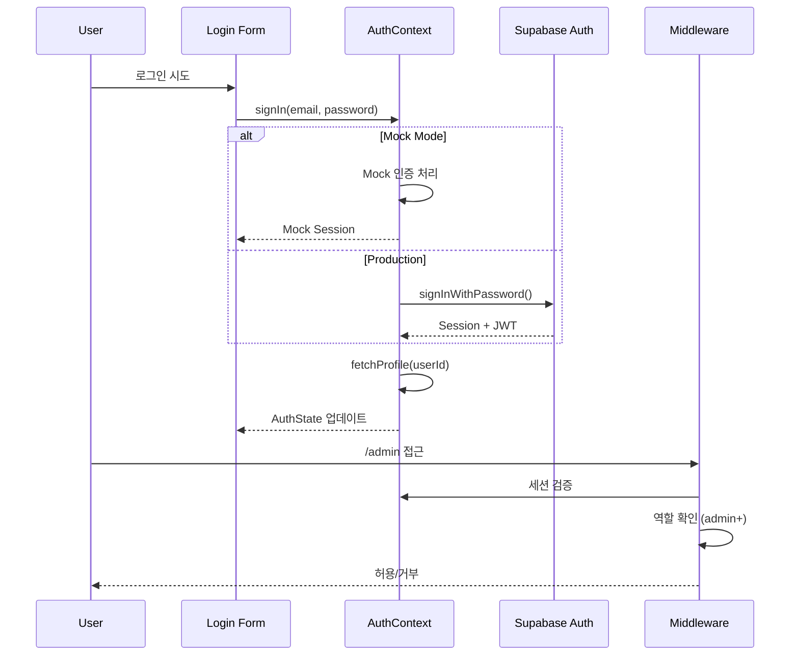
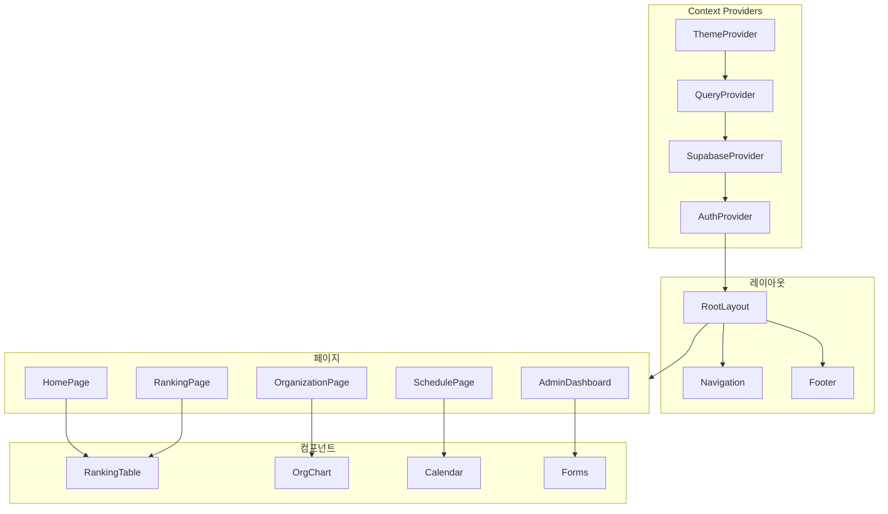

# RG Family - 엔터프라이즈급 아키텍처 분석 보고서

> **분석일**: 2026-01-16
> **분석자**: Senior Full-Stack Architect / Tech Lead
> **목표**: 상업화를 위한 프로덕션 준비 상태 평가 및 개선 로드맵

---

## 1. Executive Summary

### 프로젝트 개요
**RG Family**는 PandaTV 스트리머 "리나" 팬 커뮤니티의 공식 웹사이트입니다.

| 항목 | 현황 |
|------|------|
| **프레임워크** | Next.js 16.1.1 + React 19.2.3 + App Router |
| **데이터베이스** | Supabase (PostgreSQL + Auth + Storage + RLS) |
| **스타일링** | Tailwind CSS 4.1.18 + Mantine 8.3.10 + shadcn/ui |
| **상태관리** | TanStack Query 5.90.16 + React Context |
| **테스트** | Vitest + Playwright |
| **배포** | Vercel (예정) |

### 전체 평가
- **아키텍처 성숙도**: 🟢 엔터프라이즈 수준 (Clean Architecture, Repository Pattern)
- **보안 상태**: 🟡 개선 필요 (하드코딩된 자격증명, API 인증 취약)
- **코드 품질**: 🟢 우수 (TypeScript strict mode, 일관된 패턴)
- **테스트 커버리지**: 🟡 기본 수준 (E2E 설정 완료, 유닛 테스트 부족)
- **프로덕션 준비도**: 🟡 80% (보안 강화 후 배포 가능)

---

## 2. 레포지토리 구조 분석

### 디렉토리 스캐폴딩

```
rg-family/
├── src/
│   ├── app/                    # Next.js App Router (페이지)
│   │   ├── (routes)/           # 라우트 그룹
│   │   ├── admin/              # 관리자 대시보드
│   │   ├── api/                # API Routes
│   │   ├── ranking/            # 랭킹 페이지
│   │   ├── rg/                 # RG 정보 (조직도, 라이브 등)
│   │   └── schedule/           # 일정 관리
│   │
│   ├── components/             # React 컴포넌트
│   │   ├── admin/              # 관리자 전용 컴포넌트
│   │   ├── common/             # 공통 컴포넌트
│   │   ├── info/               # 정보 표시 컴포넌트
│   │   ├── layout/             # 레이아웃 컴포넌트
│   │   ├── ranking/            # 랭킹 관련 컴포넌트
│   │   ├── schedule/           # 일정 컴포넌트
│   │   └── ui/                 # shadcn/ui 기반 컴포넌트
│   │
│   ├── lib/                    # 비즈니스 로직 및 유틸리티
│   │   ├── actions/            # Server Actions (90+ 함수)
│   │   ├── auth/               # 인증/인가 로직
│   │   ├── context/            # React Context Providers
│   │   ├── hooks/              # Custom Hooks
│   │   ├── mock/               # 목업 데이터 (개발용)
│   │   ├── repositories/       # Repository Pattern 구현
│   │   ├── supabase/           # Supabase 클라이언트
│   │   └── utils/              # 유틸리티 함수
│   │
│   └── types/                  # TypeScript 타입 정의
│       ├── database.ts         # Supabase 스키마 타입 (787줄)
│       ├── common.ts           # 공통 타입
│       └── organization.ts     # 조직도 타입
│
├── e2e/                        # Playwright E2E 테스트
├── scripts/                    # 빌드/배포 스크립트
├── supabase/                   # Supabase 마이그레이션
└── docs/                       # 프로젝트 문서
```

### 파일 수 통계

| 카테고리 | 파일 수 |
|----------|---------|
| React 컴포넌트 (.tsx) | 60+ |
| TypeScript 모듈 (.ts) | 40+ |
| CSS 모듈 (.module.css) | 15+ |
| 테스트 파일 | 5+ |
| **총 코드 라인** | ~15,000+ |

---

## 3. 핵심 아키텍처 패턴

### 3.1 Repository Pattern

**구현**: `src/lib/repositories/`

```typescript
// 인터페이스 정의 (types.ts)
export interface IDataProvider {
  rankings: IRankingRepository
  seasons: ISeasonRepository
  profiles: IProfileRepository
  donations: IDonationRepository
  organization: IOrganizationRepository
  notices: INoticeRepository
  posts: IPostRepository
  timeline: ITimelineRepository
  schedules: IScheduleRepository
  // 선택적 확장
  comments?: ICommentRepository
  signatures?: ISignatureRepository
  vipRewards?: IVipRewardRepository
  // ... 15개 도메인
}
```

**Factory Pattern으로 Provider 생성**:
```typescript
export function createDataProvider(
  supabase?: SupabaseClient,
  forceType?: DataProviderType
): IDataProvider {
  const providerType = forceType ?? (USE_MOCK_DATA ? 'mock' : 'supabase')

  if (providerType === 'mock') {
    return createMockDataProvider()
  }
  return createSupabaseDataProvider(supabase || createClient())
}
```

**장점**:
- Mock ↔ Supabase 전환이 환경변수 하나로 가능
- 테스트 용이성 (의존성 주입)
- 도메인별 책임 분리

### 3.2 Server Actions

**위치**: `src/lib/actions/`

```
actions/
├── auth-actions.ts      # 인증 관련
├── banner-actions.ts    # 배너 관리
├── comment-actions.ts   # 댓글 CRUD
├── donation-actions.ts  # 후원 데이터
├── guestbook-actions.ts # 방명록
├── live-actions.ts      # 라이브 상태
├── media-actions.ts     # 미디어 콘텐츠
├── notice-actions.ts    # 공지사항
├── organization-actions.ts # 조직도
├── post-actions.ts      # 게시글
├── profile-actions.ts   # 프로필
├── ranking-actions.ts   # 랭킹
├── schedule-actions.ts  # 일정
├── season-actions.ts    # 시즌
├── signature-actions.ts # 시그니처
├── timeline-actions.ts  # 타임라인
└── vip-actions.ts       # VIP 보상
```

**총 90+ 서버 액션 함수** - 모든 데이터 조작이 서버에서 처리

### 3.3 인증 아키텍처

**구현**: Supabase Auth + Custom RBAC

```typescript
// 역할 정의
export type Role = 'superadmin' | 'admin' | 'moderator' | 'vip' | 'member'

// 접근 제어 (src/lib/auth/access-control.ts)
export function hasPermission(
  role: Role,
  requiredRoles: Role[]
): boolean {
  const roleHierarchy = {
    superadmin: 5,
    admin: 4,
    moderator: 3,
    vip: 2,
    member: 1,
  }
  // 역할 계층 기반 권한 체크
}
```

**Middleware 보호**:
```typescript
// src/middleware.ts
export const config = {
  matcher: '/admin/:path*'
}
```

---

## 4. 아키텍처 다이어그램

### 4.1 시스템 개요



### 4.2 데이터 플로우



### 4.3 인증 플로우



### 4.4 컴포넌트 계층



---

## 5. 데이터베이스 스키마

### 테이블 목록 (15개)

| 테이블 | 설명 | RLS |
|--------|------|-----|
| `profiles` | 사용자 프로필 | ✅ |
| `seasons` | 시즌 정보 | ✅ |
| `donations` | 후원 내역 | ✅ |
| `rankings` | 랭킹 데이터 | ✅ |
| `notices` | 공지사항 | ✅ |
| `posts` | 게시글 | ✅ |
| `comments` | 댓글 | ✅ |
| `schedules` | 일정 | ✅ |
| `organization` | 조직도 | ✅ |
| `live_status` | 라이브 상태 | ✅ |
| `signatures` | 시그니처 | ✅ |
| `vip_rewards` | VIP 보상 | ✅ |
| `vip_images` | VIP 이미지 | ✅ |
| `media_content` | 미디어 콘텐츠 | ✅ |
| `banners` | 배너 | ✅ |

### 타입 정의 예시

```typescript
// src/types/database.ts (787줄)
export interface Profile {
  id: string
  nickname: string
  email?: string
  avatar_url?: string
  role: Role
  unit?: 'excel' | 'crew'
  is_live?: boolean
  created_at: string
  updated_at: string
}

export interface Season {
  id: number
  name: string
  start_date: string
  end_date: string
  is_active: boolean
}

// ... 15개 테이블 전체 타입 정의
```

---

## 6. API 엔드포인트

### 현재 구현된 API Routes

| 엔드포인트 | 메서드 | 인증 | 설명 |
|------------|--------|------|------|
| `/api/live-status/update` | POST | API Key | 라이브 상태 업데이트 |
| `/api/live-status/update` | GET | Query Param | ⚠️ 보안 취약 (제거 필요) |
| `/api/live-status/sync` | POST | API Key | 라이브 상태 동기화 |

### API 인증 구조

```typescript
// 현재 구현 (취약)
if (request.method === 'GET') {
  const secret = searchParams.get('secret')
  if (secret !== process.env.LIVE_STATUS_API_SECRET) {
    return NextResponse.json({ error: 'Unauthorized' }, { status: 401 })
  }
}

// 권장 구현 (POST + Header)
const authHeader = request.headers.get('Authorization')
const expectedToken = `Bearer ${process.env.LIVE_STATUS_API_SECRET}`
if (authHeader !== expectedToken) {
  return NextResponse.json({ error: 'Unauthorized' }, { status: 401 })
}
```

---

## 7. 코드 품질 진단

### 7.1 보안 취약점 (P0)

| 위험도 | 항목 | 위치 | 개선 방안 |
|--------|------|------|-----------|
| 🔴 High | Admin 자격증명 하드코딩 | `AuthContext.tsx:28-31` | 환경변수 분리 |
| 🔴 High | GET 쿼리 파라미터 인증 | `live-status/update/route.ts` | POST only로 변경 |
| 🟡 Medium | API Secret 길이 | `.env.local` | 64자 hex로 강화 |
| 🟡 Medium | CSP 헤더 미설정 | `next.config.ts` | 보안 헤더 추가 |

### 7.2 타입 안전성 (우수)

```typescript
// ✅ 엄격한 타입 정의
export interface RankingItem {
  rank: number
  donor_id: string
  nickname: string
  total_amount: number
  unit?: 'excel' | 'crew'
}

// ✅ 제네릭 Repository 인터페이스
export interface IRepository<T> {
  findById(id: string | number): Promise<T | null>
  findAll(): Promise<T[]>
}
```

### 7.3 에러 처리 (개선 필요)

```typescript
// 현재: 에러 로깅만
try {
  const data = await repository.findAll()
} catch (error) {
  console.error('Failed to fetch:', error)
  return []
}

// 권장: 구조화된 에러 처리
try {
  const data = await repository.findAll()
} catch (error) {
  if (error instanceof DatabaseError) {
    logger.error('Database connection failed', { error })
    throw new ServiceError('DB_CONNECTION_FAILED')
  }
  throw error
}
```

### 7.4 성능 최적화 (우수)

- ✅ TanStack Query 캐싱 적용
- ✅ React 19 + Compiler 최적화
- ✅ Next.js Image 최적화
- ✅ 동적 임포트 (lazy loading)
- 🟡 번들 사이즈 모니터링 미구현

### 7.5 테스트 커버리지

| 테스트 유형 | 상태 | 파일 |
|-------------|------|------|
| E2E (Playwright) | ✅ 설정됨 | `e2e/home.spec.ts` |
| Unit (Vitest) | 🟡 부족 | 일부만 |
| Integration | ❌ 미구현 | - |

---

## 8. 개선 로드맵

### Phase 1: 즉시 적용 (Day 1-7)

| 작업 | 우선순위 | 예상 시간 |
|------|----------|-----------|
| Admin 자격증명 환경변수 분리 | P0 | 30분 |
| GET 인증 제거 (POST only) | P0 | 20분 |
| 보안 헤더 추가 (CSP, HSTS) | P1 | 30분 |
| API Secret 강화 | P1 | 10분 |
| Vercel 환경변수 설정 | P0 | 20분 |
| 프로덕션 배포 | P0 | 30분 |

### Phase 2: 단기 개선 (Day 8-30)

| 작업 | 설명 |
|------|------|
| 에러 바운더리 추가 | 전역 에러 처리 |
| 로깅 시스템 구축 | 구조화된 로그 |
| Rate Limiting | API 호출 제한 |
| Unit 테스트 확장 | 핵심 로직 테스트 |
| 성능 모니터링 | Vercel Analytics |

### Phase 3: 중기 개선 (Day 31-60)

| 작업 | 설명 |
|------|------|
| CI/CD 파이프라인 | GitHub Actions |
| 스테이징 환경 | Preview 배포 |
| 백업 자동화 | Supabase 백업 |
| 문서 자동화 | API 문서 생성 |

### Phase 4: 장기 개선 (Day 61-90)

| 작업 | 설명 |
|------|------|
| 마이크로서비스 분리 | 라이브 상태 독립 |
| CDN 최적화 | 이미지 캐싱 |
| A/B 테스팅 | 기능 플래그 |
| 국제화 (i18n) | 다국어 지원 |

---

## 9. UI/UX 개선 제안

### 현재 디자인 시스템

```css
/* globals.css에서 정의된 테마 변수 */
--color-primary: #fd68ba;      /* 메인 핑크 */
--live-color: #00d4ff;         /* 라이브 시안 */
--gold: #ffd700;               /* 1등 */
--silver: #c0c0c0;             /* 2등 */
--bronze: #cd7f32;             /* 3등 */
```

### 개선 제안

| 항목 | 현재 | 개선 |
|------|------|------|
| 타이포그래피 | 다양한 크기 혼재 | 일관된 스케일 시스템 |
| 간격 | 불규칙 | 8px 그리드 시스템 |
| 애니메이션 | 기본 | Framer Motion 활용 |
| 접근성 | 부분 적용 | WCAG 2.1 AA 준수 |
| 반응형 | 모바일 지원 | 태블릿 최적화 추가 |

---

## 10. 결론 및 권장사항

### 강점
1. **견고한 아키텍처**: Clean Architecture + Repository Pattern
2. **현대적 스택**: Next.js 16 + React 19 + TypeScript
3. **확장 가능한 구조**: 도메인별 명확한 분리
4. **개발 생산성**: Mock/Prod 전환 용이

### 개선 필요 사항
1. **보안 강화 필수**: 하드코딩된 자격증명 제거
2. **테스트 확대**: 유닛 테스트 커버리지 향상
3. **모니터링 구축**: 에러/성능 추적 시스템
4. **문서화**: API 및 컴포넌트 문서

### 프로덕션 준비도: 80%

보안 이슈 해결 후 **즉시 배포 가능** 상태입니다.

---

## 부록: 파일별 책임

### 핵심 파일 목록

| 파일 | 책임 | 라인 수 |
|------|------|---------|
| `src/types/database.ts` | DB 스키마 타입 | 787 |
| `src/app/globals.css` | 디자인 시스템 | 1,280 |
| `src/lib/repositories/index.ts` | Repository Factory | 200+ |
| `src/lib/context/AuthContext.tsx` | 인증 상태 관리 | 266 |
| `src/middleware.ts` | 라우트 보호 | 50+ |

---

*이 문서는 2026-01-16에 생성되었으며, 프로젝트 변경 시 업데이트가 필요합니다.*
