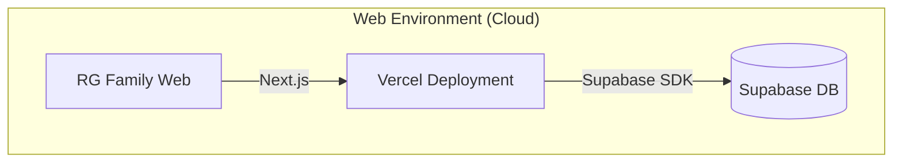

# RG Family 프로젝트 아키텍처 종합 분석 보고서

## 목차

1. [프로젝트 개요](#1-프로젝트-개요)
2. [폴더 구조 스캐폴딩](#2-폴더-구조-스캐폴딩)
3. [아키텍처 다이어그램](#3-아키텍처-다이어그램)
4. [주요 코드 로직 및 파이프라인](#4-주요-코드-로직-및-파이프라인)
5. [데이터 흐름 분석](#5-데이터-흐름-분석)
6. [문제점 및 개선 필요사항](#6-문제점-및-개선-필요사항)
7. [엔터프라이즈 로드맵](#7-엔터프라이즈-로드맵)

---

## 1. 프로젝트 개요

| 항목             | 내용                                 |
| ---------------- | ------------------------------------ |
| **프로젝트명**   | RG Family                            |
| **용도**         | PandaTV 스트리머 팬 커뮤니티 플랫폼  |
| **프레임워크**   | Next.js 16.1.1 (App Router)          |
| **React 버전**   | 19.2.3                               |
| **상태 관리**    | React Context API + Custom Hooks     |
| **스타일링**     | CSS Modules + CSS Variables          |
| **백엔드**       | Supabase (Auth + Database + Storage) |
| **배포**         | Vercel                               |
| **총 코드 라인** | ~18,589 lines                        |
| **파일 수**      | 307 files (66 directories)           |

### 기술 스택 상세

```
Frontend:
├── Next.js 16+ (App Router, React 19)
├── TypeScript 5
├── CSS Modules + CSS Variables
├── Framer Motion 12 (애니메이션)
├── Embla Carousel 8 (슬라이더)
└── Lucide React (아이콘)

Backend:
├── Supabase SSR 0.8
├── Supabase JS 2.89
└── PostgreSQL (via Supabase)

Build Tools:
├── ESLint 9
├── Babel React Compiler
└── TypeScript Compiler
```

---

## 2. 폴더 구조 스캐폴딩

```
rg-family/
├── 📁 src/
│   ├── 📁 app/                      # Next.js App Router 페이지
│   │   ├── 📁 (auth)/               # 인증 그룹 (로그인/회원가입)
│   │   │   ├── login/
│   │   │   └── signup/
│   │   ├── 📁 admin/                # Admin CMS (11개 페이지)
│   │   │   ├── banners/
│   │   │   ├── donations/
│   │   │   ├── media/
│   │   │   ├── members/
│   │   │   ├── notices/
│   │   │   ├── organization/
│   │   │   ├── posts/
│   │   │   ├── schedules/
│   │   │   ├── seasons/
│   │   │   ├── signatures/
│   │   │   └── vip-rewards/
│   │   ├── 📁 community/            # 커뮤니티
│   │   │   ├── [category]/[id]/     # 동적 게시글
│   │   │   ├── free/
│   │   │   └── vip/
│   │   ├── 📁 notice/               # 공지사항
│   │   ├── 📁 organization/         # 조직도
│   │   ├── 📁 ranking/              # 후원 랭킹
│   │   │   ├── [userId]/            # VIP 개인 페이지
│   │   │   ├── season/[id]/
│   │   │   └── vip/
│   │   ├── 📁 rg/live/              # LIVE 상태 페이지
│   │   ├── 📁 schedule/             # 일정 캘린더
│   │   ├── 📁 signature/            # 시그니처 갤러리
│   │   ├── 📁 timeline/             # 타임라인
│   │   ├── layout.tsx               # 루트 레이아웃
│   │   ├── page.tsx                 # 메인 페이지
│   │   └── globals.css              # 전역 CSS
│   │
│   ├── 📁 components/               # 재사용 컴포넌트
│   │   ├── 📁 admin/                # Admin 전용 (5개)
│   │   ├── 📁 community/            # 커뮤니티 전용 (1개)
│   │   ├── 📁 info/                 # 정보 페이지용 (9개)
│   │   ├── 📁 ranking/              # 랭킹 페이지용 (8개)
│   │   ├── 📁 schedule/             # 일정 페이지용 (4개)
│   │   ├── 📁 tribute/              # VIP 헌정 페이지용 (6개)
│   │   ├── Footer.tsx               # 푸터
│   │   ├── Hero.tsx                 # 메인 히어로 배너
│   │   ├── LiveMembers.tsx          # 라이브 멤버 섹션
│   │   ├── Navbar.tsx               # 네비게이션 바
│   │   ├── Notice.tsx               # 공지사항 섹션
│   │   ├── Providers.tsx            # 루트 프로바이더
│   │   ├── Shorts.tsx               # 숏폼 섹션
│   │   ├── ThemeToggle.tsx          # 테마 토글
│   │   └── VOD.tsx                  # VOD 섹션
│   │
│   ├── 📁 lib/                      # 유틸리티 및 설정
│   │   ├── 📁 context/              # React Context (5개)
│   │   │   ├── AuthContext.tsx
│   │   │   ├── DataProviderContext.tsx
│   │   │   ├── SupabaseContext.tsx
│   │   │   ├── ThemeContext.tsx
│   │   │   └── index.ts
│   │   ├── 📁 hooks/                # Custom Hooks (8개)
│   │   │   ├── useAuth.ts           # @deprecated
│   │   │   ├── useDataProvider.ts   # @deprecated
│   │   │   ├── useMockData.ts
│   │   │   ├── useRanking.ts
│   │   │   ├── useSchedule.ts
│   │   │   ├── useSupabase.ts       # @deprecated
│   │   │   └── index.ts
│   │   ├── 📁 mock/                 # Mock 데이터 (17개 파일)
│   │   │   ├── banners.ts
│   │   │   ├── data.ts              # @deprecated
│   │   │   ├── donations.ts
│   │   │   ├── live-status.ts
│   │   │   ├── media.ts
│   │   │   ├── notices.ts
│   │   │   ├── organization.ts
│   │   │   ├── posts.ts
│   │   │   ├── profiles.ts
│   │   │   ├── schedules.ts
│   │   │   ├── seasons.ts
│   │   │   ├── signatures.ts
│   │   │   ├── timeline.ts
│   │   │   ├── utils.ts
│   │   │   ├── vip-content.ts
│   │   │   ├── vip-tribute.ts
│   │   │   └── index.ts
│   │   ├── 📁 repositories/         # Clean Architecture 저장소
│   │   │   ├── 📁 mock/             # Mock 구현
│   │   │   ├── 📁 supabase/         # Supabase 구현
│   │   │   ├── types.ts             # 인터페이스 정의
│   │   │   └── index.ts             # Factory
│   │   ├── 📁 supabase/             # Supabase 클라이언트
│   │   │   ├── client.ts
│   │   │   ├── middleware.ts
│   │   │   └── server.ts
│   │   ├── 📁 utils/                # 유틸리티 함수
│   │   │   ├── format.ts
│   │   │   ├── youtube.ts
│   │   │   └── index.ts
│   │   └── config.ts                # 환경 설정
│   │
│   └── 📁 types/                    # TypeScript 타입
│       ├── common.ts                # 공통 타입
│       └── database.ts              # DB 스키마 타입
│
├── 📁 public/                       # 정적 자산
│   ├── 📁 assets/
│   │   ├── logo/                    # 로고 이미지
│   │   ├── members/                 # 멤버 프로필
│   │   ├── notices/                 # 공지 썸네일
│   │   └── thumbnails/              # 컨텐츠 썸네일
│   └── 📁 samples/                  # CSV 샘플
│
├── 📁 docs/                         # 문서
├── 📁 workthrough/                  # 작업 기록 (70+ 파일)
├── 📁 supabase/migrations/          # DB 마이그레이션
│
├── package.json
├── tsconfig.json
├── next.config.ts
├── eslint.config.mjs
└── CLAUDE.md                        # 프로젝트 가이드
```

---

## 3. 아키텍처 다이어그램

### 3.1 전체 시스템 아키텍처



| 시스템                     | 역할                                     | 기술 스택        | 데이터 저장소         |
| -------------------------- | ---------------------------------------- | ---------------- | --------------------- |
| **RG Family Web**          | 시청자용 대시보드 (랭킹, 통계, 커뮤니티) | Next.js, React   | Supabase (PostgreSQL) |

> **Note**: `rg-family`는 오직 Supabase(또는 Mock Data)와만 통신합니다.

### 3.2 데이터 프로바이더 아키텍처 (Repository Pattern)

```
┌─────────────────────────────────────────────────────────────────┐
│                        IDataProvider                             │
│  ┌─────────────┬─────────────┬─────────────┬─────────────────┐  │
│  │  rankings   │   seasons   │  profiles   │   donations     │  │
│  │  notices    │    posts    │organization │                 │  │
│  └─────────────┴─────────────┴─────────────┴─────────────────┘  │
└─────────────────────────────────────────────────────────────────┘
                              │
            ┌─────────────────┴─────────────────┐
            ▼                                   ▼
┌─────────────────────────┐     ┌─────────────────────────┐
│    MockDataProvider     │     │  SupabaseDataProvider   │
│    (USE_MOCK_DATA=true) │     │  (USE_MOCK_DATA=false)  │
│                         │     │                         │
│  ┌───────────────────┐  │     │  ┌───────────────────┐  │
│  │MockRankingRepo    │  │     │  │SupabaseRankingRepo│  │
│  │MockSeasonRepo     │  │     │  │SupabaseSeasonRepo │  │
│  │MockProfileRepo    │  │     │  │SupabaseProfileRepo│  │
│  │MockDonationRepo   │  │     │  │SupabaseDonationRepo│ │
│  │MockOrganizationRepo│ │     │  │SupabaseOrgRepo    │  │
│  │MockNoticeRepo     │  │     │  │SupabaseNoticeRepo │  │
│  │MockPostRepo       │  │     │  │SupabasePostRepo   │  │
│  └───────────────────┘  │     │  └───────────────────┘  │
└─────────────────────────┘     └─────────────────────────┘
            │                                   │
            ▼                                   ▼
┌─────────────────────────┐     ┌─────────────────────────┐
│    Mock Data Files      │     │      Supabase DB        │
│   (src/lib/mock/*.ts)   │     │      (PostgreSQL)       │
└─────────────────────────┘     └─────────────────────────┘
```

### 3.3 Context Provider 합성 구조

```
┌─────────────────────────────────────────────────────────────────┐
│                        <Providers>                               │
│  ┌───────────────────────────────────────────────────────────┐  │
│  │                   <SupabaseProvider>                       │  │
│  │  ┌─────────────────────────────────────────────────────┐  │  │
│  │  │                  <AuthProvider>                      │  │  │
│  │  │  ┌───────────────────────────────────────────────┐  │  │  │
│  │  │  │             <DataProviderProvider>             │  │  │  │
│  │  │  │  ┌─────────────────────────────────────────┐  │  │  │  │
│  │  │  │  │            <ThemeProvider>               │  │  │  │  │
│  │  │  │  │                                          │  │  │  │  │
│  │  │  │  │              {children}                  │  │  │  │  │
│  │  │  │  │                                          │  │  │  │  │
│  │  │  │  └─────────────────────────────────────────┘  │  │  │  │
│  │  │  └───────────────────────────────────────────────┘  │  │  │
│  │  └─────────────────────────────────────────────────────┘  │  │
│  └───────────────────────────────────────────────────────────┘  │
└─────────────────────────────────────────────────────────────────┘

의존성 그래프:
SupabaseProvider
    └── AuthProvider (supabase 필요)
        └── DataProviderProvider (supabase 필요)
            └── ThemeProvider (독립적)
```

### 3.4 페이지 라우팅 구조

```
app/
├── layout.tsx                    # 루트 레이아웃 (Providers 포함)
├── page.tsx                      # 메인 페이지 (/)
│
├── (auth)/                       # Route Group: 인증
│   ├── layout.tsx                # 인증 레이아웃
│   ├── login/page.tsx            # /login
│   └── signup/page.tsx           # /signup
│
├── admin/                        # Admin 섹션
│   ├── layout.tsx                # Admin 레이아웃 (Sidebar)
│   ├── page.tsx                  # /admin (대시보드)
│   ├── banners/page.tsx          # /admin/banners
│   ├── donations/page.tsx        # /admin/donations
│   ├── media/page.tsx            # /admin/media
│   ├── members/page.tsx          # /admin/members
│   ├── notices/page.tsx          # /admin/notices
│   ├── organization/page.tsx     # /admin/organization
│   ├── posts/page.tsx            # /admin/posts
│   ├── schedules/page.tsx        # /admin/schedules
│   ├── seasons/page.tsx          # /admin/seasons
│   ├── signatures/page.tsx       # /admin/signatures
│   └── vip-rewards/page.tsx      # /admin/vip-rewards
│
├── community/
│   ├── page.tsx                  # /community (리다이렉트)
│   ├── free/page.tsx             # /community/free
│   ├── vip/page.tsx              # /community/vip
│   └── [category]/[id]/page.tsx  # /community/:category/:id
│
├── notice/
│   ├── page.tsx                  # /notice
│   └── [id]/page.tsx             # /notice/:id
│
├── organization/page.tsx         # /organization
├── schedule/page.tsx             # /schedule
├── signature/page.tsx            # /signature
├── timeline/page.tsx             # /timeline
│
├── ranking/
│   ├── page.tsx                  # /ranking
│   ├── vip/page.tsx              # /ranking/vip
│   ├── [userId]/page.tsx         # /ranking/:userId (VIP 개인)
│   └── season/[id]/page.tsx      # /ranking/season/:id
│
└── rg/live/page.tsx              # /rg/live
```

---

## 4. 주요 코드 로직 및 파이프라인

### 4.1 데이터 접근 패턴

```typescript
// 1. Factory Pattern - 환경에 따른 Provider 생성
export function createDataProvider(
  supabase?: SupabaseClient,
  forceType?: DataProviderType
): IDataProvider {
  const providerType = forceType ?? (USE_MOCK_DATA ? "mock" : "supabase");

  switch (providerType) {
    case "mock":
      return mockDataProvider;
    case "supabase":
      return new SupabaseDataProvider(supabase);
  }
}

// 2. Context를 통한 전역 접근
export function useRankings() {
  const { provider } = useDataProviderContext();
  return provider.rankings;
}

// 3. 컴포넌트에서 사용
const rankings = useRankings();
const data = await rankings.getRankings({ seasonId: 4 });
```

### 4.2 인증 파이프라인

```
[사용자] → [로그인 폼] → [AuthContext] → [Supabase Auth]
                              ↓
                      [세션 저장 (Cookie)]
                              ↓
                      [useAuth() 훅 반환]
                              ↓
                      [보호된 페이지 접근]
```

### 4.3 테마 시스템

```css
/* globals.css - CSS 변수 기반 테마 */
:root {
  /* 라이트 모드 기본값 */
  --background: #fafafa;
  --text-primary: #0a0a0a;
}

[data-theme="dark"] {
  /* 다크 모드 오버라이드 */
  --background: #050505;
  --text-primary: #f0f0f0;
}
```

```typescript
// ThemeContext.tsx
export function ThemeProvider({ children }) {
  const [theme, setTheme] = useState<Theme>("dark");

  useEffect(() => {
    document.documentElement.setAttribute("data-theme", theme);
  }, [theme]);
}
```

---

## 5. 데이터 흐름 분석

### 5.1 메인 페이지 데이터 흐름

```
page.tsx (Server Component)
    │
    ├── <Navbar />
    ├── <Hero /> ─────────── mockBanners (슬라이더)
    │
    ├── <LiveMembers /> ──── useSupabase() → organization 테이블
    │                        (Mock: mockOrganization)
    │
    ├── <Notice /> ────────── useSupabase() → notices 테이블
    │                         (Mock: mockNotices)
    │
    ├── <Shorts /> ────────── useSupabase() → media_content 테이블
    │                         (Mock: mockShorts)
    │
    ├── <VOD /> ───────────── useSupabase() → media_content 테이블
    │                         (Mock: mockVOD)
    │
    └── <Footer />
```

### 5.2 랭킹 페이지 데이터 흐름

```
ranking/page.tsx
    │
    ├── useRanking() 훅
    │   ├── seasons 조회 (활성 시즌)
    │   └── donations 집계 (순위 계산)
    │
    ├── <RankingPodium /> ─── Top 3 (Gold/Elite 스타일)
    │
    └── <RankingList /> ───── 4위 이하 (게이지 바)
        └── <RankingCard />
            └── <GaugeBar />
```

### 5.3 데이터베이스 스키마 관계

```
┌──────────────┐     ┌──────────────┐     ┌──────────────┐
│   profiles   │────→│  donations   │←────│   seasons    │
│              │     │              │     │              │
│ id (PK)      │     │ donor_id (FK)│     │ id (PK)      │
│ nickname     │     │ season_id(FK)│     │ name         │
│ total_donation│    │ amount       │     │ is_active    │
└──────────────┘     └──────────────┘     └──────────────┘
        │                                         │
        │                                         │
        ▼                                         │
┌──────────────┐     ┌──────────────┐             │
│ organization │     │ vip_rewards  │─────────────┘
│              │     │              │
│ id (PK)      │     │ profile_id   │
│ unit         │     │ season_id    │
│ is_live      │     │ rank         │
│ parent_id    │     │              │
└──────────────┘     └──────────────┘
```

---

## 6. 문제점 및 개선 필요사항

### 6.1 아키텍처 문제점

#### 🔴 심각 (High Priority)

| 문제                        | 영향                                         | 해결 방안                             |
| --------------------------- | -------------------------------------------- | ------------------------------------- |
| **Deprecated 훅 사용**      | 27개 파일에서 `useSupabase()` 사용 중        | `useSupabaseContext()`로 마이그레이션 |
| **일관성 없는 데이터 접근** | 일부는 Repository, 일부는 직접 Supabase 쿼리 | Repository 패턴 통일                  |
| **USE_MOCK_DATA 분산**      | 19개 파일에서 개별 import                    | DataProvider로 통합                   |

#### 🟡 중간 (Medium Priority)

| 문제                     | 영향                          | 해결 방안            |
| ------------------------ | ----------------------------- | -------------------- |
| **Console.log 다수**     | 30+ 에러 로깅이 console.error | Logger 서비스 도입   |
| **Deprecated 파일 존재** | `src/lib/mock/data.ts`        | 삭제 또는 리다이렉트 |
| **타입 안전성 부족**     | 일부 `as unknown` 캐스팅      | Strict 타입 정의     |

#### 🟢 낮음 (Low Priority)

| 문제                     | 영향                 | 해결 방안        |
| ------------------------ | -------------------- | ---------------- |
| **매직 넘버**            | 하드코딩된 값들      | 상수 파일로 추출 |
| **CSS 변수 일부 미사용** | 일부 하드코딩된 색상 | CSS 변수로 통일  |

### 6.2 코드 중복 분석

```
중복 패턴 발견:
┌──────────────────────────────────────────────────────────────┐
│ 패턴: USE_MOCK_DATA 분기 로직                                │
│ 발생: 19개 파일                                               │
│                                                              │
│ // 현재 (각 컴포넌트에서 반복)                                │
│ if (USE_MOCK_DATA) {                                         │
│   setData(mockData)                                          │
│   return                                                     │
│ }                                                            │
│ const { data } = await supabase.from('table').select()       │
│                                                              │
│ // 개선안 (Repository 패턴 사용)                              │
│ const repo = useDataProviderContext()                        │
│ const data = await repo.someRepository.findAll()             │
└──────────────────────────────────────────────────────────────┘
```

### 6.3 Import 참조 문제

```
┌─────────────────────────────────────────────────────────────┐
│ 문제: 두 가지 import 경로 혼용                               │
│                                                             │
│ ❌ 현재 (Legacy)                                            │
│ import { useSupabase } from '@/lib/hooks/useSupabase'       │
│                                                             │
│ ✅ 권장 (Context)                                           │
│ import { useSupabaseContext } from '@/lib/context'          │
└─────────────────────────────────────────────────────────────┘

영향받는 파일:
- src/app/organization/page.tsx
- src/app/rg/live/page.tsx
- src/app/notice/*.tsx
- src/app/community/*.tsx
- src/app/admin/*.tsx (11개)
- src/components/*.tsx (6개)
```

---

## 7. 엔터프라이즈 로드맵

### Phase 1: 기술 부채 해소 (1-2주)

```
┌─────────────────────────────────────────────────────────────────┐
│ 1.1 Deprecated 훅 마이그레이션                                  │
│     - useSupabase() → useSupabaseContext()                     │
│     - useAuth() → useAuthContext()                             │
│     - useDataProvider() → useDataProviderContext()             │
│                                                                 │
│ 1.2 데이터 접근 통일                                            │
│     - 모든 컴포넌트가 Repository 패턴 사용                      │
│     - USE_MOCK_DATA 개별 import 제거                           │
│                                                                 │
│ 1.3 코드 정리                                                   │
│     - @deprecated 파일 삭제                                     │
│     - 미사용 export 정리                                        │
│     - ESLint 규칙 강화                                          │
└─────────────────────────────────────────────────────────────────┘
```

### Phase 2: 품질 향상 (2-3주)

```
┌─────────────────────────────────────────────────────────────────┐
│ 2.1 로깅 시스템                                                 │
│     - Logger 서비스 구현                                        │
│     - Error Boundary 추가                                       │
│     - Sentry 또는 유사 서비스 연동                              │
│                                                                 │
│ 2.2 테스트 인프라                                               │
│     - Jest + React Testing Library 설정                        │
│     - 핵심 컴포넌트 단위 테스트                                 │
│     - Repository 통합 테스트                                    │
│                                                                 │
│ 2.3 성능 최적화                                                 │
│     - React.memo 적용                                           │
│     - useMemo/useCallback 최적화                                │
│     - 이미지 최적화 (next/image)                                │
│     - 코드 스플리팅 강화                                        │
└─────────────────────────────────────────────────────────────────┘
```

### Phase 3: 기능 완성 (3-4주)

```
┌─────────────────────────────────────────────────────────────────┐
│ 3.1 미구현 기능 완성                                            │
│     - Top 1-3 헌정 페이지 (/ranking/[userId])                   │
│     - 실시간 라이브 상태 (PandaTV API 연동)                     │
│     - 푸시 알림 시스템                                          │
│                                                                 │
│ 3.2 인증 강화                                                   │
│     - OAuth 로그인 (Google/Kakao)                               │
│     - 세션 관리 개선                                            │
│     - Role-based Access Control 강화                            │
│                                                                 │
│ 3.3 Admin 기능 확장                                             │
│     - 대시보드 통계 차트                                        │
│     - 일괄 작업 기능                                            │
│     - 활동 로그                                                 │
└─────────────────────────────────────────────────────────────────┘
```

### Phase 4: 엔터프라이즈 기능 (4-6주)

```
┌─────────────────────────────────────────────────────────────────┐
│ 4.1 확장성                                                      │
│     - 다국어 지원 (i18n)                                        │
│     - 멀티 테넌시 (다른 스트리머 지원)                          │
│     - API Rate Limiting                                         │
│                                                                 │
│ 4.2 모니터링                                                    │
│     - 성능 모니터링 (Web Vitals)                                │
│     - 사용자 분석 (Google Analytics)                            │
│     - 실시간 대시보드                                           │
│                                                                 │
│ 4.3 보안                                                        │
│     - CSP 헤더 설정                                             │
│     - SQL Injection 방어 (이미 Supabase로 해결)                 │
│     - XSS 방어 강화                                             │
│     - 정기 보안 감사                                            │
│                                                                 │
│ 4.4 인프라                                                      │
│     - CI/CD 파이프라인 (GitHub Actions)                         │
│     - 스테이징 환경                                             │
│     - 자동 배포 (Vercel)                                        │
│     - 백업 전략                                                 │
└─────────────────────────────────────────────────────────────────┘
```

### 구현 우선순위 매트릭스

```
                    영향도 (High)
                        │
     Phase 2.1          │          Phase 1.1
     (로깅/에러)        │          (Deprecated 마이그레이션)
                        │
                        │          Phase 1.2
                        │          (데이터 접근 통일)
    ────────────────────┼───────────────────────
                        │
     Phase 4.1          │          Phase 3.1
     (확장성)           │          (미구현 기능)
                        │
                    영향도 (Low)
        노력 (High)                노력 (Low)
```

---

## 결론

### 현재 상태 평가

| 항목            | 점수       | 비고                             |
| --------------- | ---------- | -------------------------------- |
| 아키텍처 설계   | ⭐⭐⭐⭐   | Clean Architecture 적용됨        |
| 코드 일관성     | ⭐⭐⭐     | 일부 레거시 패턴 혼용            |
| 타입 안전성     | ⭐⭐⭐⭐   | TypeScript 잘 활용               |
| 테스트 커버리지 | ⭐         | 테스트 미구현                    |
| 문서화          | ⭐⭐⭐⭐   | CLAUDE.md, workthrough 잘 관리   |
| 디자인 시스템   | ⭐⭐⭐⭐⭐ | CSS 변수 기반 일관된 테마        |
| **총점**        | **3.5/5**  | 상업화 가능, 기술 부채 해소 필요 |

### 핵심 액션 아이템

1. **즉시 해결**: Deprecated 훅 마이그레이션 (27개 파일)
2. **단기 목표**: Repository 패턴 통일 및 중복 제거
3. **중기 목표**: 테스트 인프라 구축 및 미구현 기능 완성
4. **장기 목표**: 엔터프라이즈 기능 (다국어, 모니터링, 보안)

---

_생성일: 2026-01-02_
_작성: Claude Code Architecture Analysis_
